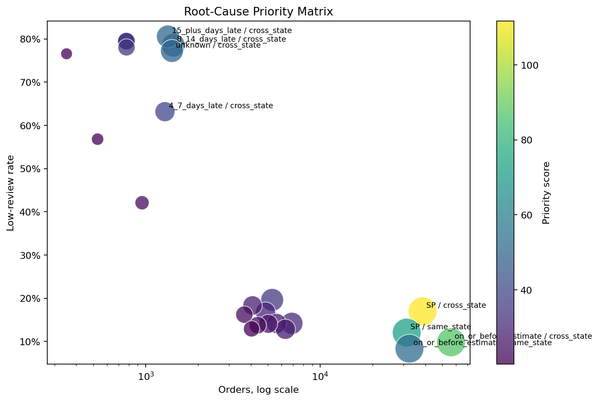
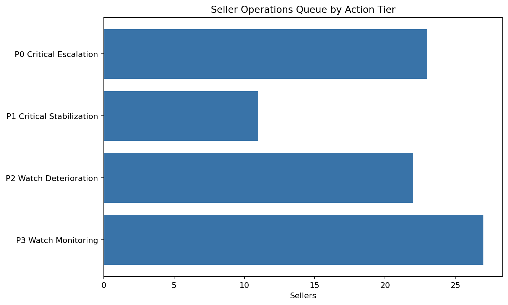
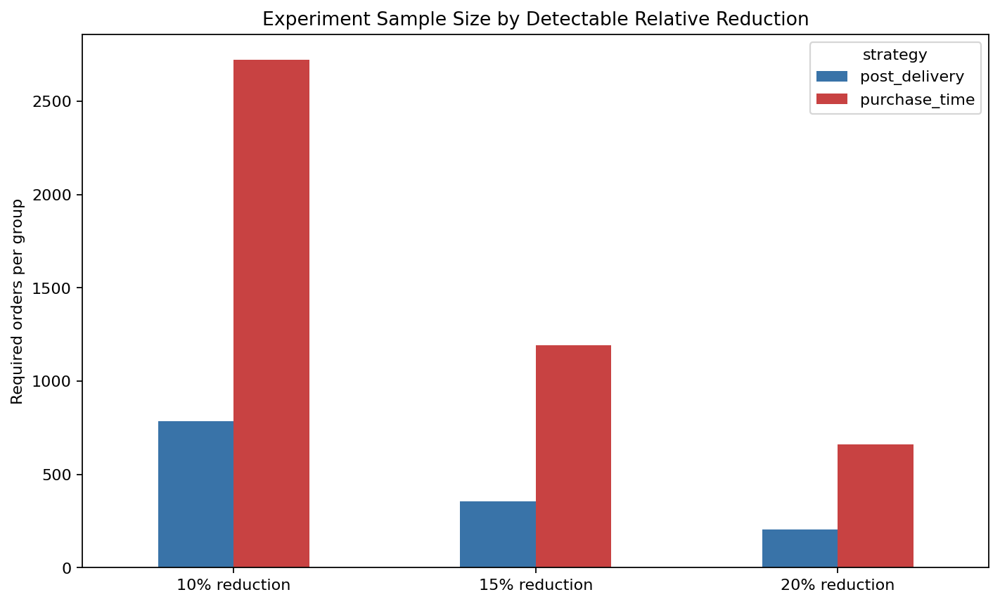

# Olist E-Commerce Operations Analytics

[](https://github.com/Ashlynn99/olist-ecommerce-analytics/actions/workflows/quality.yml)

End-to-end marketplace analytics project combining business intelligence, leakage-aware risk
modeling, seller monitoring, customer lifecycle analysis, and intervention ROI simulation.

I built the project around a practical operating question: **how should an e-commerce marketplace
identify customer-experience risk early, prioritize limited operations capacity, and decide whether
intervention is economically justified?**

Data source: [Kaggle Olist Brazilian E-Commerce Dataset](https://www.kaggle.com/datasets/olistbr/brazilian-ecommerce)

## Executive Summary

- Built a reproducible Python, SQL, and Streamlit workflow across 9 relational source tables and
  99,441 orders, with 13 ordered notebooks and reusable scripts under `src/`.
- Identified delivery delay and cross-state logistics as the main experience-risk layers: orders
  delivered 15+ days late had a 78.9% low-review rate, and cross-state routes contributed 67.4% of
  all low reviews.
- Developed separate purchase-time and post-delivery risk models to distinguish prevention from
  service-recovery use cases.
- Converted seller scoring into a monthly operating workflow with alert tiers, owners, SLA
  expectations, diagnostic focus, and a prioritized action queue.
- Translated model rankings into ROI scenarios and an A/B experiment design for validating whether
  risk-based interventions create measurable business value.

## Core Business Questions

1. Where are marketplace value and customer-experience risks concentrated?
2. Which orders and sellers should operations teams prioritize under limited capacity?
3. Under what assumptions does risk-based intervention create positive expected value?

## Key Results

| Area | Result |
|---|---|
| Marketplace scale | 99,441 orders and 16.0M BRL gross payment volume |
| Delivery experience | 8.1% late-delivery rate; 78.9% low-review rate for orders 15+ days late |
| Post-delivery risk model | 0.763 ROC-AUC; top 10% captured 41.7% of low reviews |
| Purchase-time risk model | 0.640 ROC-AUC; top 10% captured 21.9% of low reviews without current-order delivery outcomes |
| Customer lifecycle | 2.3% observed 90-day repeat rate; median 29 days to second purchase |
| Seller monitoring | 34 critical and 49 watch sellers in the latest complete month; 44 sellers escalated |
| Seller operations queue | 83 sellers prioritized; 23 P0 escalations; 33,212 BRL estimated value at risk |
| Root-cause backlog | SP cross-state seller routes contributed 44.7% of all low reviews |
| Intervention simulation | Highest-risk 5% maximized base-case expected value for both strategies |
| Model value vs random | +6,678 BRL purchase-time and +37,421 BRL post-delivery incremental scenario value |
| Experiment design | 5,248 candidate orders assigned through deterministic treatment/control split |

## Selected Visuals

### Root-Cause Priority Matrix



### Seller Operations Queue



### Purchase-Time Risk Model


### Experiment Sample Size Plan



## Interactive Dashboard

The Streamlit dashboard turns the analysis into a multi-page operating tool:

- Executive KPI Overview
- Experience Root Cause
- Seller Risk Monitoring
- Seller Action Queue
- Purchase-Time Risk Triage
- Intervention ROI Simulator
- Experiment Design

Run it locally after generating the analysis outputs:

```bash
make dashboard
```

## Technical Stack

`Python` · `pandas` · `scikit-learn` · `SQL` · `DuckDB` · `Streamlit` · `Plotly` · `Matplotlib`

Key modeling and analytical controls:

- Time-based train/test split
- Purchase-time feature leakage controls
- As-of seller history features
- Fixed 90-day repeat-purchase observation window
- Empirical-Bayes-style seller risk smoothing
- Random-selection value benchmark
- Conservative, base, and optimistic intervention scenarios

## Reproduce

```bash
git clone https://github.com/Ashlynn99/olist-ecommerce-analytics.git
cd olist-ecommerce-analytics

python3 -m venv .venv
source .venv/bin/activate
pip install -r requirements.txt
pip install -r requirements-dev.txt

# Download the 9 Kaggle CSV files into data/raw/
make analysis
make check
make dashboard
```

Useful standalone commands:

```bash
make purchase-model
make cohort
make seller-monitor
make intervention-value
make root-cause
make seller-playbook
make experiment-design
```

## Project Structure

```text
├── dashboard/
│   └── app.py                # Streamlit operations dashboard
├── notebooks/                # 13 ordered analysis notebooks
├── scripts/
│   ├── run_pipeline.py       # End-to-end notebook runner
│   └── quality_check.py      # Repository integrity and syntax checks
├── src/                      # Reusable modeling and monitoring modules
├── sql/                      # Reusable DuckDB business queries
├── reports/                  # Results, charts, summaries, and full report
└── data/                     # Raw and generated data instructions
```

Run `make check` to validate Python syntax, Markdown formatting, notebook JSON, Makefile targets,
critical file line structure, and required project paths.

## Detailed Documentation

- [Full analytical report](reports/final_report.md)
- [Purchase-time model summary](reports/purchase_time_model_summary.md)
- [Cohort and repeat analysis](reports/cohort_repeat_analysis_summary.md)
- [Seller monthly monitoring](reports/seller_monthly_monitoring_summary.md)
- [Intervention value simulation](reports/intervention_value_summary.md)
- [Root-cause decomposition](reports/root_cause_analysis_summary.md)
- [Seller operations playbook](reports/seller_operations_playbook.md)
- [Intervention experiment design](reports/intervention_experiment_design.md)
- [Data setup instructions](data/README.md)

## Decision Boundaries

- The historical dataset covers 2016–2018 and does not represent current Olist operations.
- The purchase-time model is designed for prevention; the post-delivery model is designed for
  service recovery.
- Seller alerts prioritize investigation and should not be used as automatic penalties.
- Intervention-value outputs are scenarios, not realized causal savings. A randomized pilot is
  required before rollout.
