# Olist E-Commerce Analytics, Customer Lifecycle, and Risk Modeling

## Project Overview

I built this project to analyze the Brazilian Olist e-commerce marketplace dataset from a business, customer-lifecycle, and operations perspective. The goal was to understand marketplace growth, delivery performance, observed repeat-purchase behavior, and how low-review risk can be ranked at different stages of the order lifecycle.

The project covers the full analytics workflow:

1. Data understanding across 9 raw CSV tables
2. Data cleaning and order-level analytical table creation
3. Business EDA with KPI and experience analysis
4. SQL analytics using DuckDB
5. Post-delivery low-review risk modeling
6. Seller, logistics, and model lift analysis
7. Leakage-controlled purchase-time low-review risk modeling
8. Cohort and observed repeat-purchase analysis
9. Monthly seller risk monitoring and operational alerting
10. Intervention cost, ROI, and expected-value simulation

Data source: [Olist Brazilian E-Commerce Public Dataset on Kaggle](https://www.kaggle.com/datasets/olistbr/brazilian-ecommerce)

## Business Questions

- How did Olist's orders, gross payment volume, and average payment value evolve over time?
- Which product categories, customer states, and payment methods drive revenue?
- How does delivery performance relate to customer review scores?
- Which order segments have the highest risk of receiving low reviews?
- After delivery, can a simple machine learning model rank orders by low-review risk?
- How much low-review risk can be identified immediately after purchase without using delivery outcomes?
- What does observed repeat-purchase behavior look like across cohorts and first-order experiences?
- Which sellers show meaningful monthly risk deterioration, and which alerts carry the most commercial exposure?
- Under different costs and intervention effects, how much model-ranked outreach is economically justified?

## Key Findings

- Total orders analyzed: 99,441
- Delivered orders: 96,470, equal to 97.0% of orders
- Gross payment volume based on `payment_total`, including freight: 16,008,872 BRL
- Average payment value per order: 161 BRL
- Average delivery time: 12.6 days
- Late delivery rate among delivered orders: 8.1%
- Average review score: 4.09
- Low-review rate, defined as review score <= 2: 14.7%
- Highest gross payment volume month: 2017-11, with 1,194,883 BRL and 7,544 orders
- Top category by revenue: health_beauty
- Top customer state by gross payment volume: SP
- Orders delivered 15+ days late had a low-review rate of 78.9%
- Cross-state seller-orders averaged 15.0 delivery days versus 7.9 days for same-state seller-orders
- The top 10% highest-risk orders identified by the model captured 41.7% of all low reviews in the test period
- 35 sellers were classified as high-value / high-risk, covering 9,890 associated orders
- The purchase-time model achieved 0.640 ROC-AUC and 0.240 PR-AUC without using current-order delivery outcomes
- The purchase-time model's top 10% risk segment captured 21.9% of low reviews, with 2.19x lift
- Observed repeat-customer rate among customers with delivered orders was 3.0%
- The 90-day repeat rate was 2.3%, and median time to a second delivered order was 29 days
- In the latest complete monitoring month, 34 sellers were classified as critical and 49 as watch
- Critical sellers represented 11.6% of monthly seller-order value and 14.3% of seller-orders
- 44 sellers escalated from stable or watch status relative to the previous month
- Under the base intervention assumptions, both strategies maximize expected net value at the highest-risk 5% of test orders
- Purchase-time prevention produced an estimated 2,759 BRL net value, while post-delivery recovery produced 15,158 BRL
- Compared with random selection at the same contact volume, model ranking added an estimated 6,678 BRL and 37,421 BRL respectively

## Selected Visuals

### Monthly Orders and Gross Payment Volume

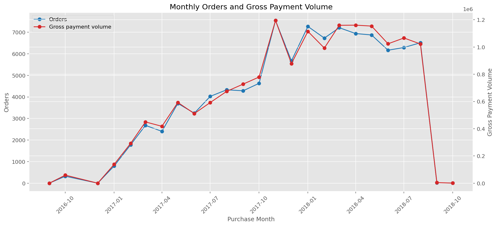

### Delivery Delay and Low Review Rate

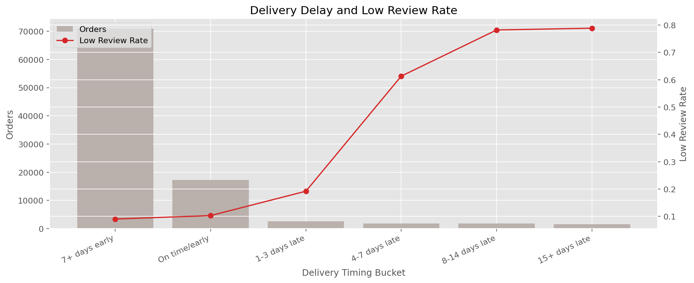

### Category Experience Map

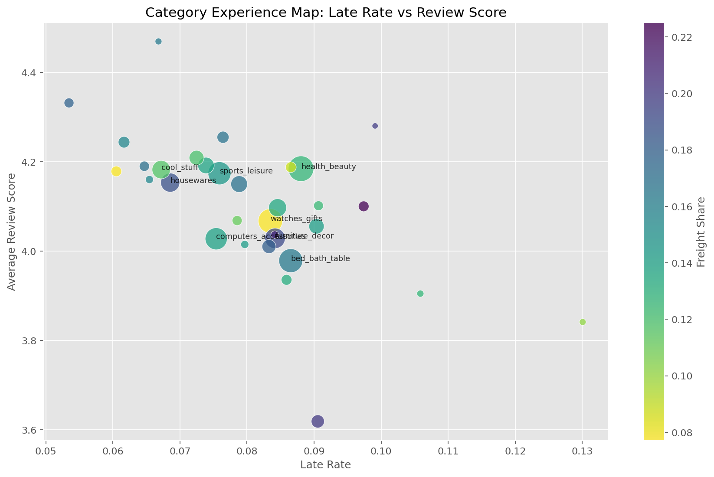

### Low Review Risk Ranking ROC Curve

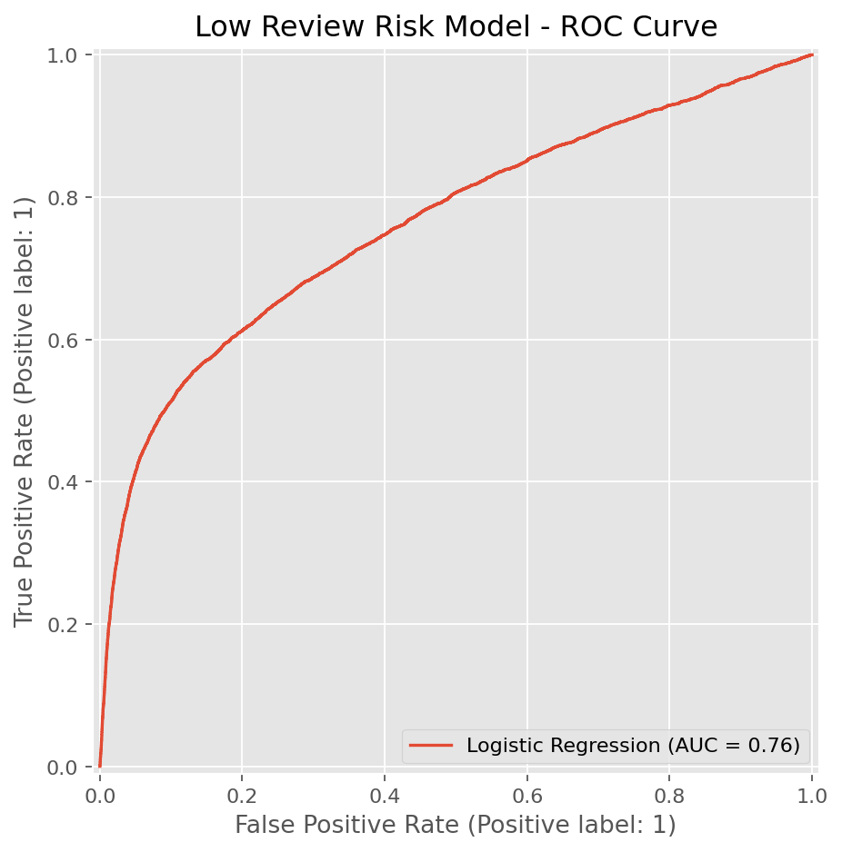

### Purchase-Time Model Cumulative Gain

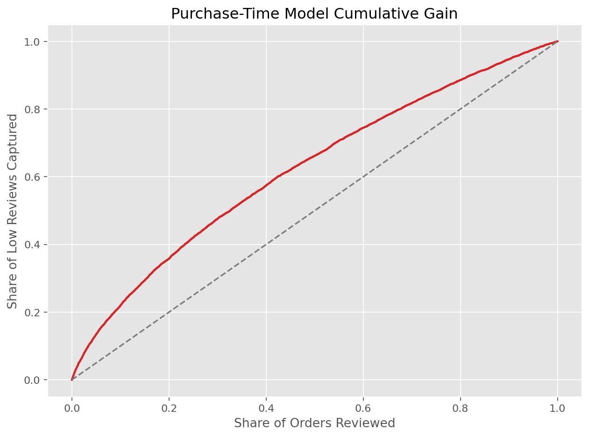

### Observed Cohort Repeat-Purchase Activity

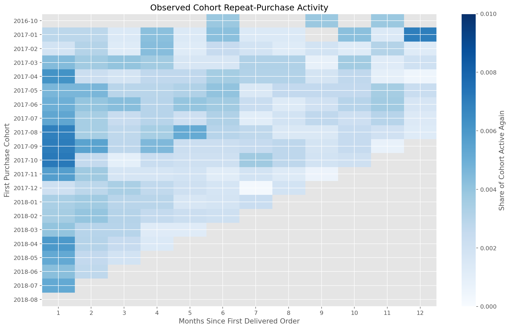

### Seller Monthly Risk Priority Matrix

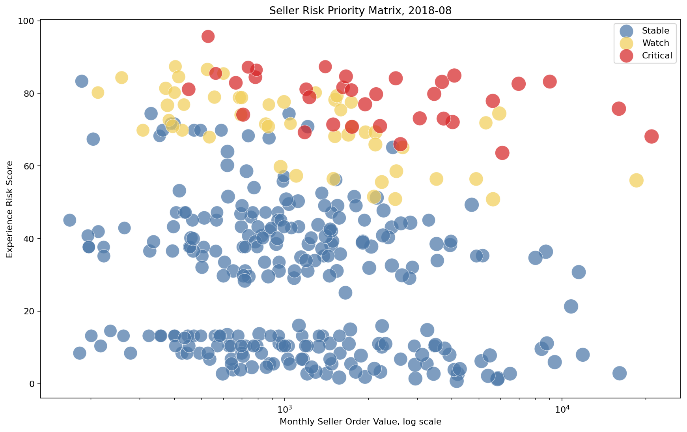

### Intervention Expected Net Value

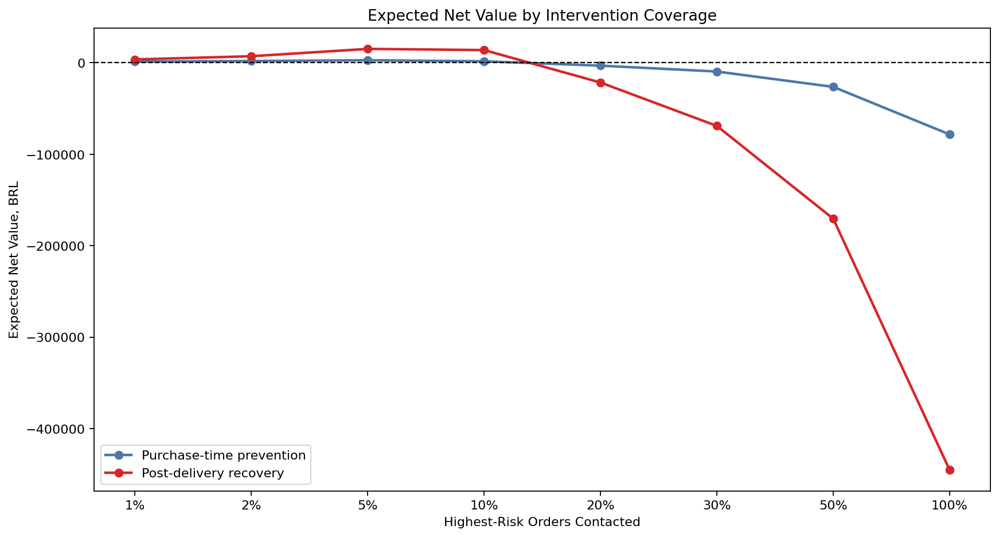

## Additional Analysis

I added four focused analyses to make the project more useful for marketplace operations.

### 1. Seller Performance Scorecard

I segmented sellers by marketplace value and customer experience risk. This helps identify sellers that are commercially important but may need operational follow-up.

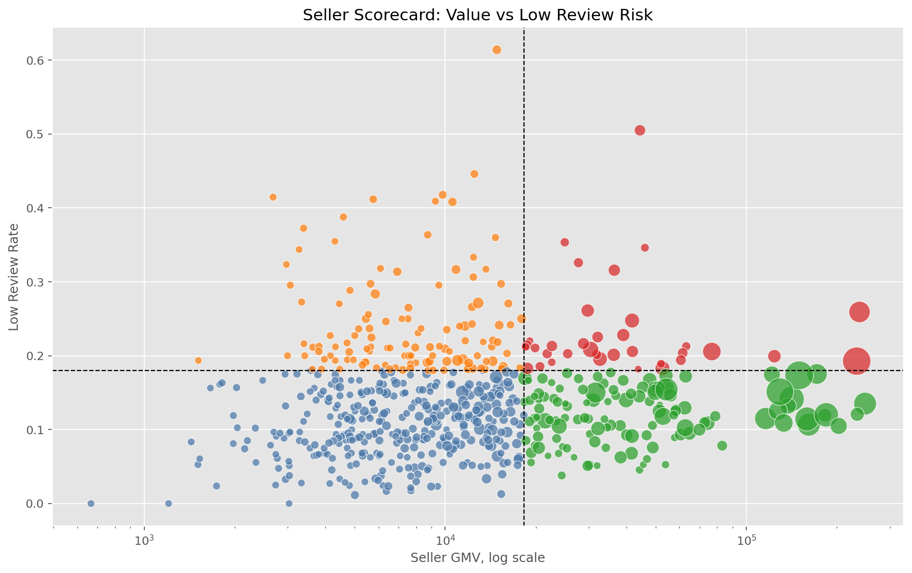

### 2. Seller Monthly Risk Monitoring

I converted the static seller scorecard into a recurring monthly monitoring system. The monitor combines low-review, late-delivery, and cancellation risk with seller-level deterioration and commercial exposure.

To reduce small-sample false alerts, the risk rates are smoothed toward the monthly marketplace rate. Sellers also need sufficient monthly order and review volume before they can receive a watch or critical alert.

The priority score combines 55% experience risk, 25% deterioration, and 20% seller value, with a volume-based reliability adjustment. Critical alerts represent the top 10% of eligible sellers by priority score with an experience risk score of at least 60.

Latest complete month, 2018-08:

- Active sellers: 1,278
- Sellers eligible for alerts: 343
- Critical sellers: 34
- Watch sellers: 49
- Sellers escalated from stable or watch: 44
- Critical sellers' share of monthly seller-order value: 11.6%

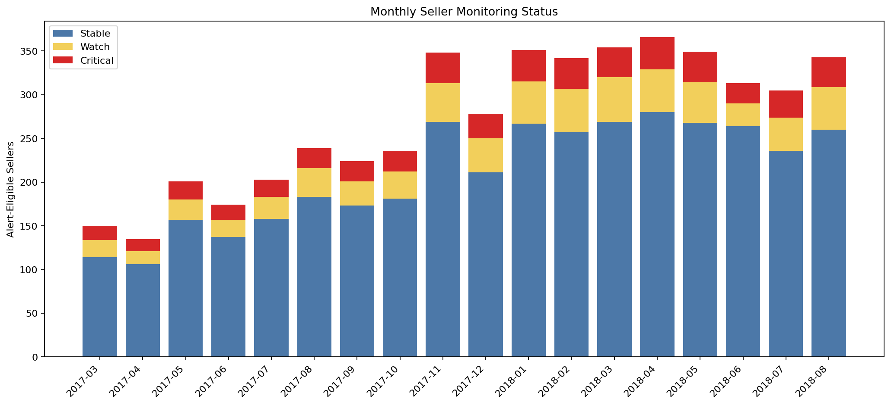

### 3. Logistics Distance and Cross-State Analysis

I used customer and seller zip-code prefix geolocation to estimate customer-seller distance and compare same-state versus cross-state routes.

Key result:

- Same-state seller-orders: 34,907
- Cross-state seller-orders: 61,767
- Same-state average delivery days: 7.9
- Cross-state average delivery days: 15.0
- Same-state low-review rate: 10.9%
- Cross-state low-review rate: 14.7%

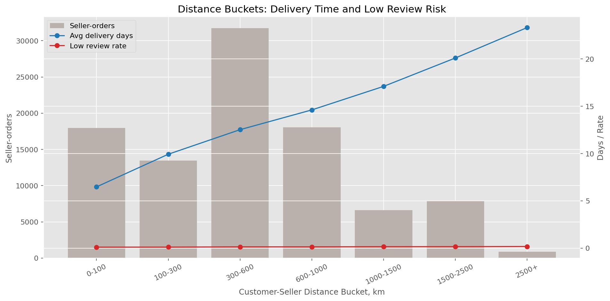

### 4. Model Lift and Gain Simulation

I translated the low-review model into a customer support prioritization view.

Key result:

- Top 10% highest-risk orders captured 41.7% of low reviews
- Top 10% segment precision was 55.8%
- Top 10% lift versus baseline was 4.17x

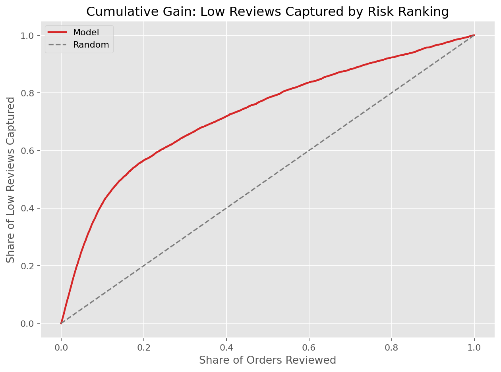

## Post-Delivery Risk Ranking Model

The modeling task ranks delivered orders by the probability of receiving a low review score, defined as `review_score <= 2`.

The model excludes review-derived fields to avoid data leakage. It uses a time-based split:

- Train: orders before 2018-01-01
- Test: orders on or after 2018-01-01

| Model | ROC-AUC | PR-AUC | Precision | Recall | F1 |
|---|---:|---:|---:|---:|---:|
| Dummy baseline | 0.500 | 0.134 | 0.000 | 0.000 | 0.000 |
| Logistic regression, tuned threshold | 0.763 | 0.446 | 0.506 | 0.465 | 0.485 |

The model is best interpreted as a post-delivery risk-ranking tool for customer support prioritization and operational review. I would not use it as an automated decision system.

Important boundary: the feature set includes post-delivery information such as actual delivery days, delivery delay, and late-delivery status. This makes the current model useful for service recovery after delivery, not for pure purchase-time prediction.

The lift analysis makes the model easier to discuss in business terms: reviewing only the top 10% highest-risk orders would cover 41.7% of low reviews in the test set.

## Purchase-Time Risk Model

I built a second model for earlier intervention using only features available at or before purchase time.

The model excludes current-order delivery outcomes and review information. Seller-history features are calculated as-of each order timestamp and only include seller delivery or review events observed before the current purchase.

| Model | ROC-AUC | PR-AUC | Top 10% Capture | Top 10% Lift |
|---|---:|---:|---:|---:|
| Purchase-time logistic regression | 0.640 | 0.240 | 21.9% | 2.19x |
| Post-delivery logistic regression | 0.763 | 0.446 | 41.7% | 4.17x |

This comparison quantifies the trade-off between earlier intervention and predictive strength. The purchase-time model is weaker, but it can support preventive monitoring before delivery outcomes are known.

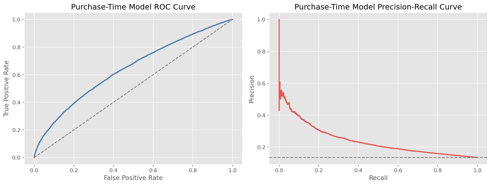

## Cohort and Observed Repeat Behavior

I used `customer_unique_id` and delivered orders to add a customer-lifecycle view.

Key results:

- Customers with delivered orders: 93,358
- Observed repeat customers: 2,801
- Observed repeat-customer rate: 3.0%
- Customers eligible for a fixed 90-day repeat window: 75,320
- 90-day repeat rate: 2.3%
- Median time to second delivered order: 29 days

Because the dataset covers a limited observation window, I describe these results as **observed repeat behavior**, not true long-term retention. The 90-day metric only includes customers with sufficient follow-up time.

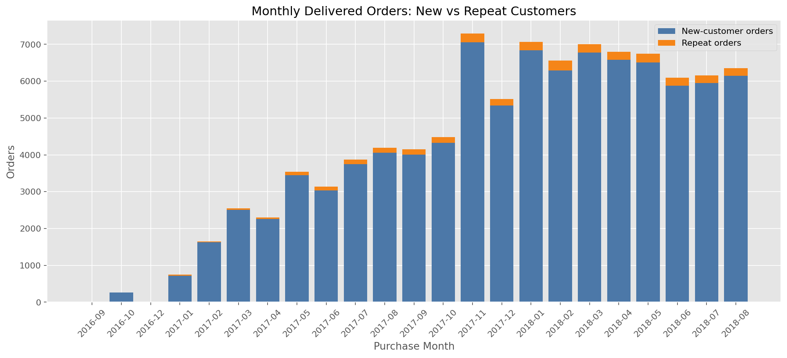

## Seller Monthly Risk Monitoring

The seller monitor creates a seller-month panel and assigns operational statuses using:

- Smoothed low-review, late-delivery, and cancellation rates
- Deterioration relative to the seller's prior history
- Monthly seller-order value and order volume
- Minimum evidence requirements before issuing an alert

The score is intentionally transparent: 55% experience risk, 25% deterioration, and 20% seller value, followed by a volume-based reliability adjustment.

The output is a prioritized watchlist with alert drivers and recommended actions. It is intended for seller operations and investigation, not automatic penalties.

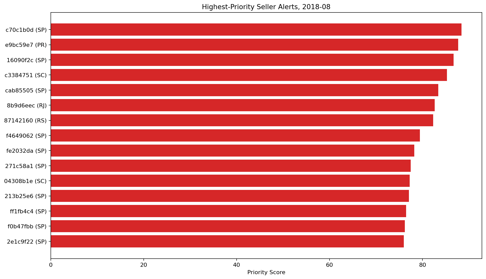

## Intervention Cost and Expected Value

I translated both risk rankings into retrospective intervention scenarios.

Base assumptions:

| Strategy | Cost per Contact | Assumed Effectiveness | Value per Successful Recovery |
|---|---:|---:|---:|
| Purchase-time prevention | 3 BRL | 15% | 75 BRL |
| Post-delivery recovery | 12 BRL | 35% | 75 BRL |

Under these assumptions, the highest-risk 5% segment maximized expected net value for both strategies:

| Strategy | Orders Contacted | Low Reviews Captured | Expected Net Value | Incremental Value vs Random | ROI |
|---|---:|---:|---:|---:|---:|
| Purchase-time prevention | 2,624 | 13.4% | 2,759 BRL | 6,678 BRL | 35.1% |
| Post-delivery recovery | 2,624 | 25.3% | 15,158 BRL | 37,421 BRL | 48.1% |

These are scenario estimates, not realized savings. The sensitivity analysis shows that conservative assumptions make both strategies unprofitable, supporting a randomized pilot before rollout.

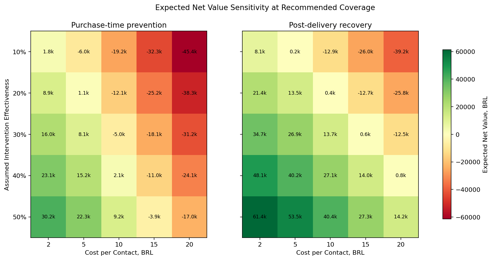

## Repository Structure

```text
.
├── data/
│   ├── README.md
│   ├── raw/                 # raw Kaggle CSV files, not committed
│   ├── processed/           # generated cleaned files, not committed
│   └── database/            # generated DuckDB database, not committed
├── notebooks/
│   ├── 01_data_understanding.ipynb
│   ├── 02_data_cleaning.ipynb
│   ├── 03_eda_business_analysis.ipynb
│   ├── 04_sql_business_analysis.ipynb
│   ├── 05_modeling_low_review_risk.ipynb
│   ├── 06_seller_logistics_lift_analysis.ipynb
│   ├── 07_purchase_time_risk_model.ipynb
│   ├── 08_cohort_repeat_analysis.ipynb
│   ├── 09_seller_monthly_risk_monitor.ipynb
│   └── 10_intervention_value_simulation.ipynb
├── reports/
│   ├── final_report.md
│   ├── eda_key_findings.md
│   ├── modeling_low_review_summary.md
│   ├── purchase_time_model_summary.md
│   ├── cohort_repeat_analysis_summary.md
│   ├── seller_monthly_monitoring_summary.md
│   ├── intervention_value_summary.md
│   ├── model_low_review_metrics.csv
│   ├── model_low_review_feature_importance.csv
│   ├── additional_analysis_summary.md
│   ├── seller_segment_summary.csv
│   ├── logistics_distance_summary.csv
│   ├── logistics_route_summary.csv
│   ├── model_low_review_lift_table.csv
│   └── figures/
├── scripts/
│   ├── check_data.py
│   └── run_pipeline.py
├── sql/
│   ├── 00_create_database.py
│   ├── 01_business_kpis.sql
│   ├── 02_growth_analysis.sql
│   ├── 03_delivery_experience.sql
│   ├── 04_category_region_analysis.sql
│   └── 05_customer_review_risk.sql
├── requirements.txt
├── Makefile
├── LICENSE
├── src/
│   ├── purchase_time_risk_model.py
│   ├── cohort_repeat_analysis.py
│   ├── seller_monthly_risk_monitor.py
│   ├── intervention_value_simulation.py
│   └── seller_logistics_lift_analysis.py
└── README.md
```

## How to Reproduce

### 1. Clone the repository

```bash
git clone https://github.com/Ashlynn99/olist-ecommerce-analytics.git
cd olist-ecommerce-analytics
```

### 2. Create a virtual environment

```bash
python3 -m venv .venv
source .venv/bin/activate
python -m pip install --upgrade pip
pip install -r requirements.txt
```

### 3. Download the data

Download the dataset from Kaggle:

[Olist Brazilian E-Commerce Public Dataset](https://www.kaggle.com/datasets/olistbr/brazilian-ecommerce)

Place the 9 raw CSV files under:

```text
data/raw/
```

Expected files:

```text
olist_customers_dataset.csv
olist_geolocation_dataset.csv
olist_order_items_dataset.csv
olist_order_payments_dataset.csv
olist_order_reviews_dataset.csv
olist_orders_dataset.csv
olist_products_dataset.csv
olist_sellers_dataset.csv
product_category_name_translation.csv
```

### 4. Run the reproducible workflow

The project includes a small Makefile so the main workflow can be checked and executed from the command line:

```bash
make setup
make data
make analysis
make purchase-model
make cohort
make seller-monitor
make intervention-value
make report
```

`make data` checks whether the expected raw Kaggle CSV files exist. `make analysis` executes the notebook code in order and regenerates processed files, charts, SQL outputs, and model artifacts. The pipeline uses a direct Python executor by default so it does not depend on a separate Jupyter kernel process.

### 5. Manual notebook order

The notebooks can also be run manually in this order:

```text
01_data_understanding.ipynb
02_data_cleaning.ipynb
03_eda_business_analysis.ipynb
04_sql_business_analysis.ipynb
05_modeling_low_review_risk.ipynb
06_seller_logistics_lift_analysis.ipynb
07_purchase_time_risk_model.ipynb
08_cohort_repeat_analysis.ipynb
09_seller_monthly_risk_monitor.ipynb
10_intervention_value_simulation.ipynb
```

The second notebook generates the processed analytical tables. The fourth notebook creates a local DuckDB database at `data/database/olist.duckdb`.

## SQL Layer

DuckDB is used as an embedded local database. No separate database application is required.

The SQL files answer reusable business questions:

- `01_business_kpis.sql`: executive KPI summary
- `02_growth_analysis.sql`: monthly gross payment volume, orders, average payment value, and month-over-month growth
- `03_delivery_experience.sql`: delivery delay buckets and review risk
- `04_category_region_analysis.sql`: category and state performance
- `05_customer_review_risk.sql`: high-risk order segments

## Project Limitations

- The dataset is historical and covers 2016 to 2018.
- The low-review model uses post-delivery features such as actual delivery days, so it is best suited for post-delivery recovery or operational review.
- The purchase-time model avoids current-order delivery outcomes, but its seller-history features depend on historical events available in the dataset.
- Repeat-purchase metrics are limited by the dataset observation window and should not be interpreted as true long-term retention.
- Seller monitoring alerts use relative thresholds and smoothed historical data; they support investigation rather than proving seller fault.
- Intervention value depends on assumed action cost, effectiveness, and recovery value; it should be validated through a controlled pilot.
- `payment_total` includes both product value and freight, so I treat it as gross payment volume rather than merchandise-only GMV.
- The analysis is observational and should not be interpreted as causal proof.

## Recommended Next Steps

- Build a Streamlit or Power BI dashboard from `orders_analysis_base.csv`.
- Run randomized intervention pilots and replace scenario assumptions with observed incremental impact.
- Validate seller alerts against additional complaint, refund, and seller-action data if available.
- Add exact route or carrier-level features if operational data becomes available.
- Move more repeated notebook logic into reusable Python modules under `src/`.
