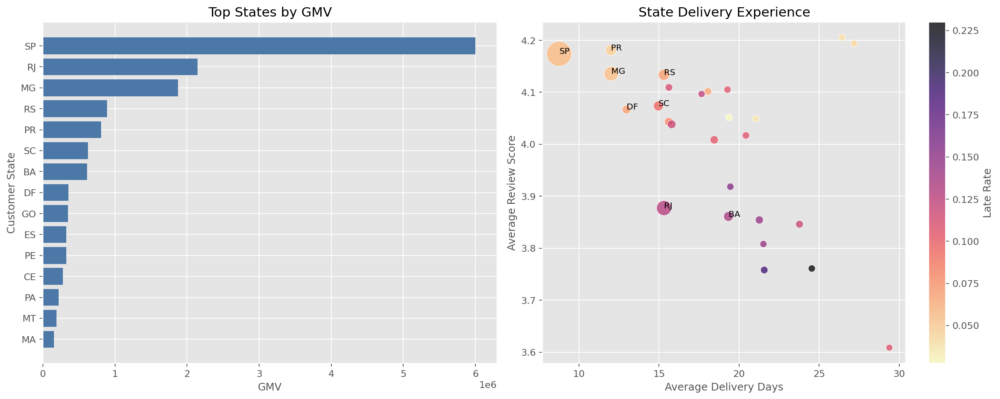
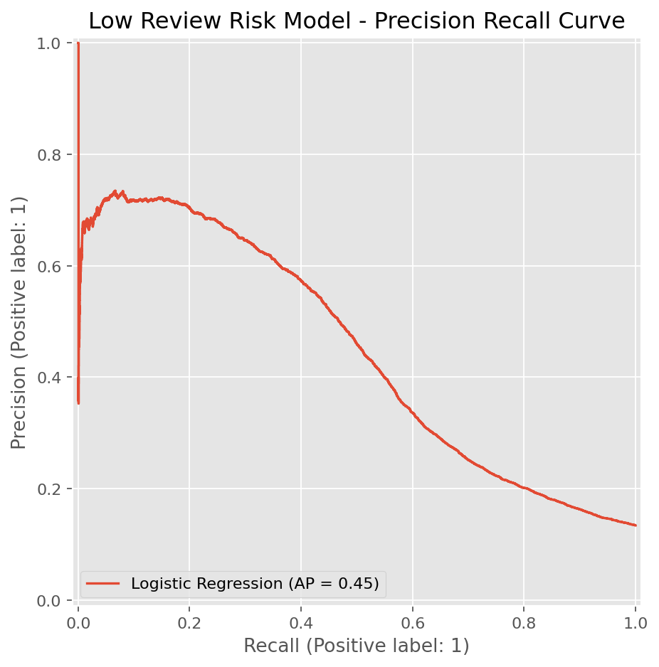

# Olist E-Commerce Analytics Report

## Executive Summary

I analyzed Olist's Brazilian e-commerce marketplace data from 2016 to 2018 to understand growth, delivery performance, customer satisfaction, observed repeat-purchase behavior, and low-review risk across the order lifecycle. The project combines Python data cleaning, business EDA, SQL analysis, customer cohort analysis, and two leakage-aware machine learning use cases.

The main finding is that customer experience is closely related to delivery performance. Orders delivered more than 15 days late have a low-review rate of 78.9%, while the overall low-review rate is 14.7%. This makes delivery delay the clearest operational issue in the analysis.

## Data Scope

The raw dataset contains 9 CSV files covering:

- Orders
- Customers
- Order items
- Payments
- Reviews
- Products
- Sellers
- Geolocation
- Product category translation

The final analytical base table contains 99,441 order-level records and 53 columns.

## Data Preparation

I kept the raw data unchanged and created a processed layer for analysis.

Key preparation steps:

- Converted order timestamps into datetime fields
- Created delivery metrics such as delivery days, estimated delivery days, delivery delta, and late delivery flag
- Aggregated payment records to order level
- Aggregated review records to order level
- Enriched order items with product, category, and seller information
- Aggregated item-level data to order level
- Collapsed geolocation records by zip code prefix to avoid row duplication during joins

This produced the main analytical table:

```text
data/processed/orders_analysis_base.csv
```

## Business KPI Summary

| Metric | Value |
|---|---:|
| Total orders | 99,441 |
| Delivered orders | 96,470 |
| Delivery rate | 97.0% |
| Gross payment volume, based on `payment_total` including freight | 16,008,872 BRL |
| Average payment value per order | 161 BRL |
| Freight share of payment total | 14.1% |
| Average delivery time | 12.6 days |
| Late delivery rate | 8.1% |
| Average review score | 4.09 |
| Low-review rate | 14.7% |

`payment_total` includes product value and freight, so I treat this measure as gross payment volume rather than merchandise-only GMV. Product revenue and freight value are tracked separately in the analytical table.

## Growth Analysis

The strongest gross payment volume month was 2017-11, with 1,194,883 BRL and 7,544 orders. Monthly order and payment trends show clear growth across most of the observed period, with seasonal peaks and later-period volatility.

Relevant figure:


## Delivery and Customer Experience

Delivery performance is the clearest customer experience driver in this project.

Key finding:

- Orders delivered 15+ days late had a low-review rate of 78.9%.
- Overall low-review rate was 14.7%.

This means extreme delivery delays are associated with a much higher probability of customer dissatisfaction.

Relevant figure:


## Category Analysis

The top category by revenue was `health_beauty`, generating 1,442,254 BRL across 8,802 orders.

Category analysis should not be based on revenue alone. A more useful management view combines:

- Revenue
- Order volume
- Freight share
- Average delivery time
- Late delivery rate
- Average review score
- Low-review rate

This helps identify categories that are both commercially important and experience-sensitive.

Relevant figure:


## Geographic Analysis

The top customer state by gross payment volume was SP, with 5,998,227 BRL and 41,746 orders.

State-level analysis helps identify where revenue is concentrated and where delivery experience differs. This can support logistics planning, regional seller development, and customer support prioritization.

Relevant figure:



## SQL Analytics Layer

I used DuckDB as a local embedded database. The SQL layer makes the business logic auditable and reusable.

The project includes SQL files for:

- Executive KPIs
- Monthly growth
- Delivery experience
- Category and region performance
- Low-review risk segmentation

This mirrors a realistic analytics workflow where Python handles cleaning and modeling, while SQL handles repeatable business queries.

## Post-Delivery Low-Review Risk Model

The machine learning task ranks delivered orders by the probability of receiving a low review score, defined as:

```text
review_score <= 2
```

The model excludes review-derived fields to avoid leakage. It uses a time-based split:

- Train: orders before 2018-01-01
- Test: orders on or after 2018-01-01

Model results:

| Model | ROC-AUC | PR-AUC | Precision | Recall | F1 |
|---|---:|---:|---:|---:|---:|
| Dummy baseline | 0.500 | 0.134 | 0.000 | 0.000 | 0.000 |
| Logistic regression, tuned threshold | 0.763 | 0.446 | 0.506 | 0.465 | 0.485 |

The model is best used as a post-delivery risk-ranking tool. It can help prioritize delivered orders for customer support follow-up or operational review, but it should not be treated as an automated decision system.

Important boundary: the model uses post-delivery features such as actual delivery days, estimated delivery days, delivery delay, and late-delivery status. These variables are only known after delivery, so this is not a pure purchase-time prediction system.

Relevant figures:




## Purchase-Time Low-Review Risk Model

I built a second model for early risk triage using only information available at or before purchase time.

Current-order delivery outcomes and review information are excluded. Seller-history features are calculated as-of each purchase timestamp and only use seller delivery or review events observed before the current order.

Model comparison:

| Model | ROC-AUC | PR-AUC | Top 10% Capture | Top 10% Lift |
|---|---:|---:|---:|---:|
| Purchase-time logistic regression | 0.640 | 0.240 | 21.9% | 2.19x |
| Post-delivery logistic regression | 0.763 | 0.446 | 41.7% | 4.17x |

The purchase-time model provides weaker ranking performance, but it supports preventive monitoring before delivery outcomes are known. This makes the two models complementary rather than interchangeable.

Relevant figures:


## Cohort and Observed Repeat-Purchase Analysis

I used `customer_unique_id` and delivered orders to examine customer lifecycle behavior.

Key results:

| Metric | Value |
|---|---:|
| Customers with delivered orders | 93,358 |
| Observed repeat customers | 2,801 |
| Observed repeat-customer rate | 3.0% |
| Customers eligible for 90-day analysis | 75,320 |
| 90-day repeat rate | 2.3% |
| Median days to second delivered order | 29 |

The dataset covers a limited historical window, so these figures represent observed repeat behavior rather than true long-term retention. The primary 90-day comparison reduces right-censoring by excluding customers without sufficient follow-up time.

First-order experience comparisons were descriptive rather than causal. The 90-day repeat rate was 2.3% after an on-time first order and 2.1% after a late first order. Customers with a first-order low review did not show a simple lower 90-day repeat rate, highlighting the importance of avoiding unsupported causal claims.

Relevant figures:


## Additional Analysis

I added three focused extensions to make the project more practical without making the workflow unnecessarily complex.

### Seller Performance Scorecard

The seller scorecard evaluates sellers across commercial value and customer experience risk.

Key outputs:

- High-value high-risk sellers: 35
- Orders associated with high-value high-risk sellers: 9,890

This segment is important because these sellers contribute meaningful marketplace value while also creating elevated customer dissatisfaction risk. In a marketplace setting, this type of segmentation can support seller monitoring, account management, and targeted operational follow-up.

Relevant figure:


### Logistics Distance and Cross-State Delivery

I estimated customer-seller distance using zip-code prefix geolocation and compared same-state versus cross-state routes.

Key results:

| Route Type | Seller-Orders | Avg Distance KM | Avg Delivery Days | Late Rate | Low-Review Rate |
|---|---:|---:|---:|---:|---:|
| Same-state | 34,907 | 153.8 | 7.91 | 5.9% | 10.9% |
| Cross-state | 61,767 | 851.9 | 15.03 | 9.0% | 14.7% |

This adds more context to the delivery-delay finding. Cross-state routes are longer, slower, and associated with higher low-review risk.

Relevant figure:


### Model Lift and Business Simulation

I translated the low-review model into a practical prioritization question:

> If the support team can only review the highest-risk orders, how many low reviews could it cover?

Key results:

| Highest-Risk Segment | Orders Reviewed | Low Reviews Captured | Capture Rate | Segment Precision | Lift |
|---|---:|---:|---:|---:|---:|
| Top 5% | 2,624 | 1,777 | 25.3% | 67.7% | 5.06x |
| Top 10% | 5,247 | 2,927 | 41.7% | 55.8% | 4.17x |
| Top 20% | 10,494 | 3,973 | 56.5% | 37.9% | 2.83x |

This makes the machine learning component easier to apply. The model is not just a classifier; it becomes a way to prioritize limited customer support capacity.

Relevant figure:


## Business Recommendations

1. Prioritize extreme delivery delay prevention.

   Orders delivered more than 15 days late show a very high low-review risk. Olist could monitor these orders and trigger proactive communication or recovery offers.

2. Use category-level experience monitoring.

   Revenue-heavy categories should be monitored together with delay rate, freight share, and low-review rate. High-revenue categories with weak experience metrics deserve closer review.

3. Build a low-review risk workflow.

   The model can rank delivered orders by dissatisfaction risk. Customer support teams could use this ranking to prioritize post-delivery outreach or operational review.

4. Use seller scorecards for seller performance monitoring.

   High-value high-risk sellers should be reviewed first because operational improvement in this segment can protect both marketplace value and customer experience.

5. Separate purchase-time and post-delivery models.

   Use the purchase-time model for preventive monitoring and the post-delivery model for service-recovery prioritization. Their different performance levels reflect different information availability.

6. Track customer lifecycle metrics with fixed observation windows.

   Use the 90-day observed repeat rate as a consistent monitoring metric and compare it across cohorts, categories, and first-order experiences.

## Limitations

- The dataset is historical and does not reflect current Olist operations.
- The analysis is observational and does not prove causality.
- Some features are only available after delivery, so the current model is not a pure purchase-time prediction system.
- The purchase-time model uses leakage-controlled historical seller outcomes, but data availability in a production system would need to be confirmed.
- Repeat-purchase metrics are affected by the limited observation period and do not represent true long-term retention.
- `payment_total` includes freight, so gross payment volume should not be interpreted as merchandise-only GMV.
- The dataset does not include customer demographics, marketing acquisition channels, or full seller operational history.

## Conclusion

This project shows a complete but focused analytics workflow: raw data understanding, cleaning, business analysis, SQL querying, and predictive modeling. The main business takeaway is that logistics performance is closely tied to customer satisfaction, and that low-review risk can be modeled well enough to support prioritization and operational follow-up.
